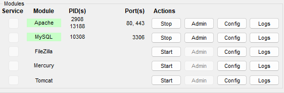

# 💯 Participantes

Arlisson Nascimento dos Santos - 04051565
Matheus Braga Pereira - 04177377

# 🎮 Jogo da Forca

Um jogo da forca interativo desenvolvido em PHP, JavaScript, HTML e CSS com sistema de ranking e banco de dados MySQL.

## 📋 Sobre o Projeto

Este é um jogo da forca completo que inclui:

- **Interface intuitiva** com teclado virtual
- **Sistema de pontuação** baseado no número de erros
- **Ranking de jogadores** com pontuações acumuladas
- **Categorias de palavras** organizadas no banco de dados
- **Área de Cadastro** para cadastrar novas palavras
- **Desenho da forca** que se completa a cada erro
- **Salvamento automático** do nome do jogador

## 🚀 Como Instalar e Executar

### Pré-requisitos

- XAMPP (Apache + MySQL)
- Navegador web

### Passo a Passo

#### 1. Baixar e Instalar o XAMPP

1. Acesse o site oficial: [https://www.apachefriends.org/](https://www.apachefriends.org/)
2. Baixe a versão mais recente do XAMPP para Windows
3. Execute o instalador e siga as instruções
4. Instale no diretório padrão (já é instalado normalmente)

#### 2. Configurar o Projeto

1. **Clone ou baixe este repositório**
2. **Copie a pasta completa do projeto** para `C:\xampp\htdocs\`
3. **Renomeie a pasta** para `hangman` (se necessário)
4. O caminho final deve ser: `C:\xampp\htdocs\hangman\`

#### 3. Iniciar os Serviços

1. Abra o **XAMPP Control Panel**
2. Inicie o serviço **Apache** (clique em "Start")
3. Inicie o serviço **MySQL** (clique em "Start")
4. Verifique se ambos estão com actions "Stop", e em module com a cor "verde"

#### 4. Acessar o Jogo

1. Abra seu navegador
2. Acesse: **[http://localhost/hangman/index.php](http://localhost/hangman/index.php)**
3. Digite seu nome e comece a jogar!

**O banco de dados será criado automaticamente** junto com as tabelas e dados iniciais ao abrir o jogo pela primeira vez.

## 🎯 Como Jogar

1. **Digite seu nome** no campo superior direito
2. Clique em **"Jogar"** no menu principal
3. **Adivinhe a palavra** clicando nas letras do teclado virtual
4. **Categoria** da palavra é mostrada como dica
5. Você tem **6 tentativas** antes de perder
6. **Pontuação** é calculada baseada no número de erros:
   - 0 erros = 6 pontos
   - 1 erro = 5 pontos
   - 2 erros = 4 pontos
   - ... e assim por diante

## 🔧 Funcionalidades Administrativas

Acesse **[http://localhost/hangman/admin.php](http://localhost/hangman/admin.php)** para:

- Cadastrar novas palavras
- Organizar por categorias
- Gerenciar o banco de palavras do jogo

## 🏆 Sistema de Ranking

- Visualize os **top 10 jogadores**
- Pontuações são **acumuladas** por jogador
- Acesse em **[http://localhost/hangman/ranking.php](http://localhost/hangman/ranking.php)**

## 🛠️ Tecnologias Utilizadas

- **Frontend:** HTML5, CSS3, JavaScript (ES6+)
- **Backend:** PHP 7+
- **Banco de Dados:** MySQL
- **Servidor:** Apache (via XAMPP)

## �️ Soluções de Erros

### Problemas com Banco de Dados

**⚠️ Importante:** Caso o banco não seja criado automaticamente ou dê algum erro/falha:

1. Verifique se não existe nenhum database chamado `hangman` no seu MySQL
2. Se existir, exclua-o e tente novamente acessar o jogo
3. Para verificar:
   - Acesse: [http://localhost/phpmyadmin](http://localhost/phpmyadmin)
   - Veja se existe um banco chamado `hangman` na lista à esquerda
   - Se existir e estiver causando problemas, exclua-o
   - Acesse novamente o jogo para que seja recriado automaticamente

### Outros Problemas Comuns

Se encontrar algum problema durante a instalação:

1. Verifique se Apache e MySQL estão rodando no XAMPP (status verde)
2. Confirme se o banco de dados foi criado corretamente
3. Verifique se o projeto está na pasta correta: `C:\xampp\htdocs\hangman\`
4. Teste o acesso ao PhpMyAdmin: [http://localhost/phpmyadmin](http://localhost/phpmyadmin)
5. Certifique-se de que não há conflitos de porta (Apache na 80, MySQL na 3306)

### Dica Importante

**🔄 Para qualquer alteração nos arquivos, sempre recarregue/reinicie a página web** pressionando `F5` ou `Ctrl + F5` para garantir que as mudanças sejam aplicadas corretamente.

---

**Desenvolvido com ❤️ usando XAMPP, PHP e JavaScript para nosso querido professor!!!!**
